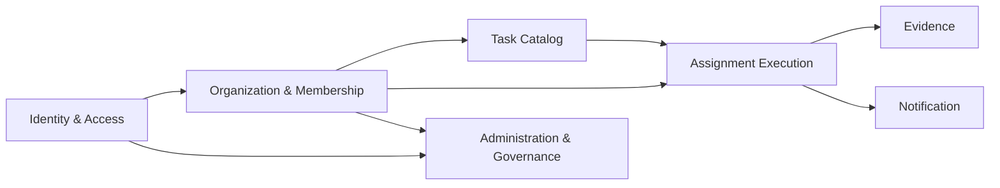

# Dokumentacja projektowa Alfee

## 1. Cel dokumentu

Ten dokument opisuje architekture domenowa aplikacji **Alfee** w podejsciu DDD (Domain-Driven Design), ze szczegolnym naciskiem na:

- bounded contexty,
- wspolny jezyk domenowy,
- granice odpowiedzialnosci,
- przeplywy miedzy kontekstami.

Dokument zostal przygotowany na podstawie aktualnej implementacji (Express + SQLite).

## 2. Kontekst systemu

Alfee to wielo-tenantowa aplikacja do zarzadzania zadaniami zespolowymi, z trzema rolami:

- `admin` - zarzadza organizacjami, rolami i czlonkostwami,
- `manager` - zarzadza zadaniami i przydzialami w aktywnej organizacji,
- `employee` - realizuje przydzielone zadania i dodaje dowody wykonania.

Architektonicznie jest to **modularny monolit**:

- jedna aplikacja (`server.js`),
- jeden magazyn danych (`src/database.js`),
- podzial logiczny przez trasy, middleware i modele SQL.

## 3. Wspolny jezyk domenowy

Kluczowe pojecia domenowe:

- **Organization (tenant)** - jednostka izolacji danych roboczych,
- **Membership** - relacja uzytkownika do organizacji (`user_organizations`),
- **Active Organization** - aktualny tenant managera w sesji,
- **Task** - szablon pracy (tytul + kroki) przypisany do organizacji,
- **Assignment** - instancja zadania przydzielona konkretnemu pracownikowi,
- **Assignment Step** - migawka kroku zadania w momencie przydzialu,
- **Evidence** - obraz potwierdzajacy wykonanie kroku,
- **Notification** - komunikat systemowy dla uzytkownika.

## 4. Bounded Contexty

### 4.1 Identity & Access Context

**Cel:** Uwierzytelnianie i autoryzacja uzytkownikow.

**Odpowiedzialnosc:**

- rejestracja i logowanie lokalne,
- logowanie Google OAuth,
- zarzadzanie rolami (`admin` / `manager` / `employee`),
- blokada konta po nieudanych probach logowania,
- utrzymanie sesji.

**Model domenowy:**

- encja: `User`,
- polityki: sila hasla, lockout, aktywnosc konta.

**Implementacja (przyklady):**

- `server.js` (flow logowania/rejestracji, Passport, session),
- `src/security/password.js`,
- `src/middleware/auth.js`.

---

### 4.2 Organization & Membership Context (Tenant Context)

**Cel:** Zarzadzanie strukturami tenantow i dostepem uzytkownikow do organizacji.

**Odpowiedzialnosc:**

- tworzenie i utrzymanie organizacji,
- przypisywanie uzytkownikow do organizacji,
- wybor aktywnej organizacji przez managera,
- egzekwowanie warunku "manager musi miec aktywna organizacje".

**Model domenowy:**

- encje: `Organization`, `Membership (UserOrganization)`,
- reguly: manager/employee dzialaja tylko w ramach membership.

**Implementacja (przyklady):**

- `src/routes/adminRoutes.js` (organizacje i membership),
- `src/middleware/tenant.js` (active tenant w sesji).

---

### 4.3 Task Catalog Context

**Cel:** Definicja i utrzymanie katalogu zadan (szablonow) dla organizacji.

**Odpowiedzialnosc:**

- tworzenie, edycja, kopiowanie i usuwanie zadan,
- utrzymanie listy krokow zadania (`task_steps`),
- ograniczenie widocznosci i operacji do aktywnej organizacji managera.

**Model domenowy:**

- agregat: `Task` + `TaskStep[]`,
- niezmiennik: zadanie nalezy do jednej organizacji.

**Implementacja (przyklady):**

- `src/routes/managerRoutes.js` (`/tasks`, `/tasks/new`, `/tasks/:id/edit`, copy/delete),
- `src/utils/tasks.js` (`normalizeSteps`).

---

### 4.4 Assignment Execution Context

**Cel:** Cykl zycia przydzialu zadania do pracownika i monitorowanie postepu.

**Odpowiedzialnosc:**

- przydzielanie zadania pracownikowi z tej samej organizacji,
- kopiowanie krokow z `TaskStep` do `AssignmentStep` (snapshot),
- zmiana statusu przydzialu (`in_progress` / `completed`),
- obliczanie postepu i raportowanie.

**Model domenowy:**

- agregat: `Assignment` + `AssignmentStep[]`,
- reguly:
  - przydzial tylko do pracownika z membership w tenantcie zadania,
  - status przydzialu wynika ze stanu krokow.

**Implementacja (przyklady):**

- `src/routes/managerRoutes.js` (tworzenie i podglad przydzialow),
- `src/routes/employeeRoutes.js` (toggle krokow, auto status),
- `src/utils/tasks.js` (`withProgress`).

---

### 4.5 Evidence Context

**Cel:** Zarzadzanie dowodami wykonania krokow.

**Odpowiedzialnosc:**

- przyjmowanie plikow obrazow dla wykonanych krokow,
- walidacja typu i limit rozmiaru,
- powiazanie dowodu z krokiem przydzialu.

**Model domenowy:**

- encja: `StepEvidence`,
- reguly:
  - dowod moze byc dodany tylko do kroku nalezacego do zalogowanego pracownika,
  - dowod dodajemy dopiero po oznaczeniu kroku jako ukonczony.

**Implementacja (przyklady):**

- `src/middleware/upload.js`,
- `src/routes/employeeRoutes.js` (upload evidence).

---

### 4.6 Notification Context

**Cel:** Informowanie uzytkownikow o istotnych zdarzeniach.

**Odpowiedzialnosc:**

- tworzenie powiadomien (np. przy nowym przydziale),
- lista powiadomien, oznaczanie jako przeczytane, masowe odczytanie,
- licznik nieprzeczytanych w warstwie globalnej UI.

**Model domenowy:**

- encja: `Notification`.

**Implementacja (przyklady):**

- `src/routes/notificationRoutes.js`,
- zapis notyfikacji w `src/routes/managerRoutes.js` podczas przydzialu,
- licznik unread w `server.js`.

---

### 4.7 Administration & Governance Context

**Cel:** Nadzor operacyjny nad systemem i integralnoscia rol.

**Odpowiedzialnosc:**

- zarzadzanie rolami uzytkownikow,
- zabezpieczenie przed degradacja ostatniego administratora,
- usuwanie organizacji wraz z danymi zaleznymi.

**Model domenowy:**

- polityki administracyjne przecinajace inne konteksty.

**Implementacja (przyklady):**

- `src/routes/adminRoutes.js`.

## 5. Context Map (aktualny)

Interpretacja:

- `Organization & Membership` jest osia izolacji tenantowej dla pracy managera i pracownika.
- `Task Catalog` dostarcza definicje, a `Assignment Execution` tworzy ich operacyjne instancje.
- `Notification` i `Evidence` sa kontekstami wspierajacymi.
- `Administration & Governance` nadpisuje polityki dostepu i struktury organizacyjne.

## 6. Kluczowe koncepcje projektowe stojace za kontekstami

1. **Tenant jako granica biznesowa**
   - Organizacja nie jest tylko etykieta; determinuje widocznosc danych i uprawnienia operacyjne.
2. **Rozdzielenie "definicji pracy" od "realizacji pracy"**
   - `Task` to wzorzec, `Assignment` to jego uruchomiona instancja dla konkretnej osoby.
3. **Snapshot krokow przy przydziale**
   - Kroki przydzialu sa kopiowane do `assignment_steps`, co stabilizuje historyczny przebieg realizacji.
4. **Autoryzacja oparta o role + membership**
   - Sama rola nie wystarcza; dostep wymaga rowniez przynaleznosci do tenantu.
5. **Bezpieczenstwo to polityka domenowa**
   - Silne hasla, lockout i aktywnosc konta sa integralna czescia modelu, nie dodatkiem.
6. **Powiadomienia jako osobny model**
   - Notyfikacje nie sa "UI-only", tylko trwala encja z cyklem zycia read/unread.

## 7. Przeplywy miedzy kontekstami (E2E)

### A. Manager przydziela zadanie

1. `Identity & Access` potwierdza role `manager`.
2. `Organization & Membership` wyznacza aktywny tenant.
3. `Task Catalog` udostepnia zadanie i kroki.
4. `Assignment Execution` tworzy przydzial i snapshot krokow.
5. `Notification` opcjonalnie tworzy komunikat dla pracownika.

### B. Employee realizuje zadanie

1. `Identity & Access` potwierdza role `employee`.
2. `Assignment Execution` pozwala przelaczac status krokow i aktualizuje status przydzialu.
3. `Evidence` przyjmuje obraz po ukonczeniu kroku.
4. `Notification` oznacza powiazana notyfikacje jako przeczytana po otwarciu zadania.

## 8. Ograniczenia obecnej implementacji

- Granice kontekstow sa logiczne, ale technicznie wspoldziela one:
  - ten sam proces aplikacji,
  - ten sam schemat bazy danych,
  - bezposrednie zapytania SQL w warstwie tras.
- Integracje miedzy kontekstami sa synchroniczne (bez event busa i bez kolejek).

To jest poprawny etap dla modularnego monolitu, ale warto o tym pamietac przy skalowaniu.

## 9. Kierunki dalszej ewolucji

1. Wydzielenie warstwy `application services` per kontekst (zamiast logiki w route handlers).
2. Wprowadzenie jawnych zdarzen domenowych (np. `AssignmentCreated`, `StepCompleted`).
3. Uporzadkowanie kontraktow miedzy kontekstami (DTO + antykorupcyjne adaptery).
4. Rozwazenie osobnych modulow danych dla kontekstow o duzej dynamice (`Assignment`, `Evidence`, `Notification`).
